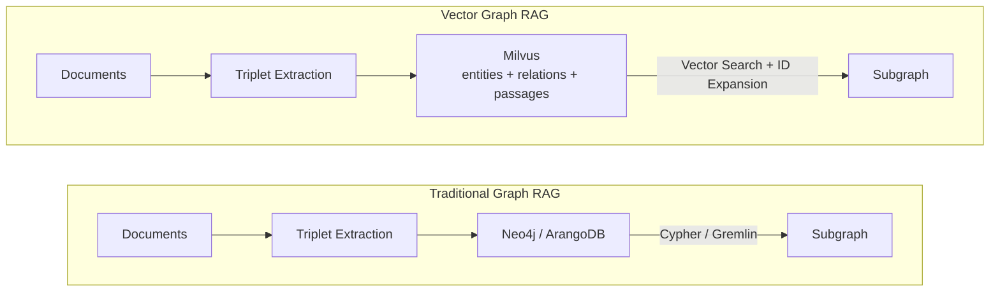
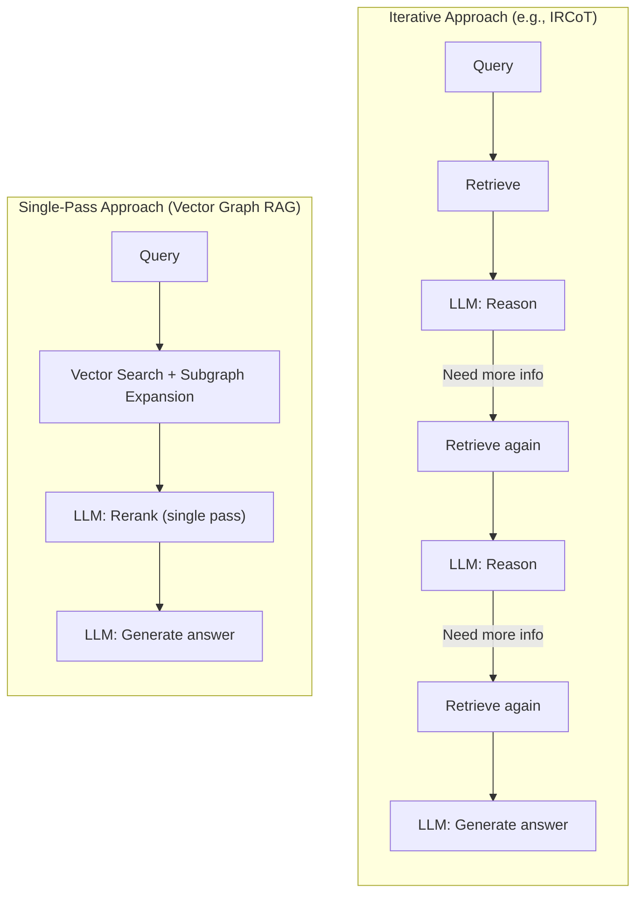
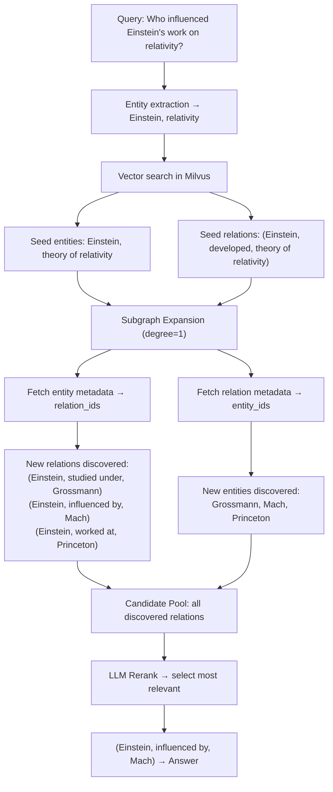
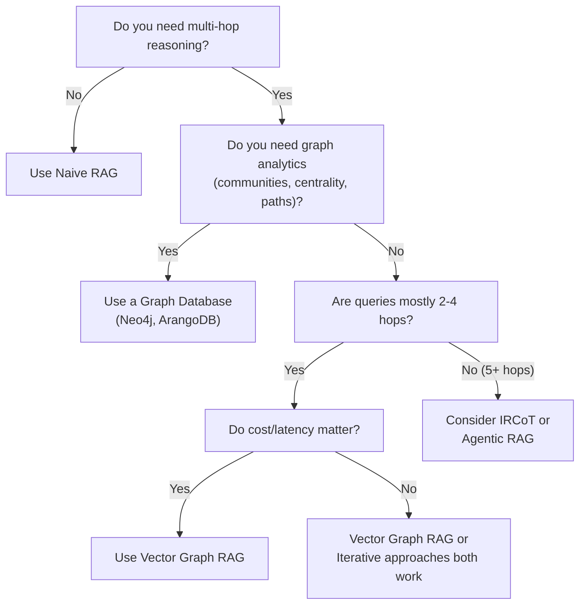

# Design Philosophy

Vector Graph RAG is built on a simple but powerful observation: **you do not need a graph database to do Graph RAG**. By encoding entities, relations, and passages as vectors in Milvus, and replacing iterative LLM agents with a single reranking pass, we achieve competitive retrieval quality at a fraction of the operational and computational cost.

This page explains the reasoning behind these choices, the trade-offs involved, and how the system compares to alternative approaches.

---

## 1. The Core Insight: Graph Structure as Vectors

### The Traditional Approach

In a conventional Graph RAG pipeline, a knowledge graph is built from documents and stored in a dedicated graph database such as Neo4j or ArangoDB. Retrieval involves writing graph traversal queries (Cypher, Gremlin) to walk edges and collect relevant subgraphs. The graph database provides native support for operations like shortest-path search, neighborhood expansion, and community detection.

### The Vector Graph RAG Approach

Vector Graph RAG takes a fundamentally different path. Instead of storing the knowledge graph in a graph database, we store **all three components** — entities, relations, and passages — as vectors in Milvus.

A relation like `(Einstein, developed, theory of relativity)` is stored as a searchable text vector with metadata linking it back to the `Einstein` and `theory of relativity` entity records. Graph traversal becomes a sequence of vector queries:

1. **Find seed nodes** — vector similarity search locates entities and relations relevant to the query.
2. **Expand outward** — follow `entity_id` and `relation_id` metadata fields to fetch neighbors from Milvus.
3. **Repeat** — each expansion hop is another Milvus query on ID fields, not a Cypher traversal.



> **Key takeaway:** Graph-like multi-hop retrieval is achievable using only vector similarity search and metadata-based ID lookups — no graph database required.

---

## 2. Why No Graph Database?

### The Simplicity Argument

Every additional database in a production stack introduces operational burden: deployment, monitoring, backup, schema management, query language expertise, and version upgrades. A graph database is no exception.

| Concern | With Graph DB | Vector Graph RAG |
|---------|--------------|-----------------|
| **Deployment** | Milvus + Neo4j (two services) | Milvus only (one service) |
| **Local development** | Docker Compose or cloud instances | `Milvus Lite` — a single local file, zero setup |
| **Query language** | Cypher / Gremlin | Python SDK only |
| **Schema management** | Node labels, relationship types, indexes | Three flat collections with metadata |
| **Scaling** | Scale two systems independently | Scale one system |

> [!TIP]
> Milvus Lite stores data as a local file (similar to SQLite). For prototyping and small-to-medium datasets, there is literally nothing to deploy — just point the `milvus_uri` to a `.db` file path.

### What You Give Up

This design intentionally trades away native graph algorithms:

- **Shortest path** — not available (but rarely needed in RAG).
- **PageRank / centrality** — not available (useful for summarization, less so for QA).
- **Community detection** — not available (Microsoft GraphRAG relies on this for global summarization).
- **ACID transactions on graph mutations** — Milvus does not support multi-collection transactions, so cascade operations (e.g., deleting an entity and all its relations) are not atomic.

> [!NOTE]
> If your use case requires graph analytics (community detection, centrality scoring, pathfinding), a dedicated graph database is the right choice. Vector Graph RAG is optimized for **retrieval-augmented generation**, not general-purpose graph analytics.

---

## 3. Single-Pass vs. Iterative Retrieval

### The Iterative Paradigm

Many state-of-the-art RAG systems use iterative retrieval, where the LLM participates in multiple rounds of search and reasoning:

| System | Strategy | LLM Calls per Query |
|--------|----------|---------------------|
| **IRCoT** | Alternate retrieval + chain-of-thought reasoning | 3–5 (retrieve → reason → retrieve → reason → ...) |
| **Self-RAG** | LLM critiques retrieved documents and re-retrieves | 2–4 |
| **Agentic RAG** | LLM has search tools and decides when to stop | 3–10+ (unbounded) |
| **Vector Graph RAG** | Vector search → expand → one LLM rerank → generate | **2** |



### Why Single-Pass Works

The key insight is that **vector search combined with subgraph expansion already produces high-quality candidate relations**. The initial retrieval is not a blind keyword search — it leverages:

1. **Semantic similarity** via dense embeddings (entities and relations are matched by meaning, not just lexical overlap).
2. **Graph structure** via subgraph expansion (one-hop neighbors of matched entities are automatically included).
3. **Multi-way retrieval** — entities and relations are searched independently, then merged.

With these three mechanisms working together, the candidate set is already rich and relevant. A single LLM reranking pass is sufficient to select the best relations from this high-quality pool.

### The Cost Advantage

Each LLM call adds latency (typically 1–3 seconds) and cost. For a system processing thousands of queries per day, the difference between 2 and 5 LLM calls per query is substantial:

| Metric | Iterative (5 calls) | Single-Pass (2 calls) | Savings |
|--------|---------------------|----------------------|---------|
| **Latency** | ~5–15s | ~2–6s | 2–3x faster |
| **Cost** (GPT-4o-mini) | ~5x base | ~2x base | 60% cheaper |
| **Cost** (GPT-4o) | ~5x base | ~2x base | 60% cheaper |

> [!TIP]
> For applications where latency and cost are secondary to accuracy on extremely complex queries (5+ hop chains, ambiguous entity resolution), iterative approaches may still be worth the overhead. See [When to Consider Alternatives](#7-when-to-consider-alternatives).

---

## 4. Subgraph Expansion: The Key Innovation

Subgraph expansion is the mechanism that enables multi-hop reasoning without a graph database. It bridges the gap between flat vector search (which finds directly relevant items) and graph traversal (which follows relational chains).

### How It Works



The expansion algorithm:

1. **Start** with seed entity IDs and relation IDs from vector search.
2. **For each entity**, fetch its `relation_ids` from Milvus metadata → add those relations to the subgraph.
3. **For each relation**, fetch its `entity_ids` from Milvus metadata → add those entities to the subgraph.
4. **Repeat** for the configured number of hops (`expansion_degree`, default: 1).

Each step is a metadata query on Milvus (`id in [...]`), not a graph traversal. The subgraph uses **lazy loading** — data is fetched from Milvus on demand, avoiding the need to load the entire knowledge graph into memory.

### Expansion Degree

The `expansion_degree` parameter controls how many hops outward from seed nodes the system explores:

| Degree | Behavior | Use Case |
|--------|----------|----------|
| **0** | No expansion; only directly matched entities/relations | Simple factoid questions |
| **1** (default) | One hop outward; includes immediate neighbors | Most multi-hop questions (2–3 hops) |
| **2** | Two hops outward; larger subgraph | Complex reasoning chains |
| **3+** | Diminishing returns; risk of noise | Rarely needed |

> [!NOTE]
> Higher expansion degrees produce larger candidate pools, which increases the load on the LLM reranker. The system includes an **eviction strategy** — when the expanded relation count exceeds a threshold, vector similarity search filters the pool down to the most relevant relations before reranking.

---

## 5. Comparison with Other Approaches

### Architecture Comparison

```mermaid
flowchart TB
    subgraph NaiveRAG["Naive RAG"]
        direction LR
        NR1[Query] --> NR2[Embed]
        NR2 --> NR3[Vector Search]
        NR3 --> NR4[Top-K Passages]
        NR4 --> NR5[LLM Generate]
    end

    subgraph GraphRAG["Microsoft GraphRAG"]
        direction LR
        MG1[Query] --> MG2[Entity Extraction]
        MG2 --> MG3[Neo4j Cypher Query]
        MG3 --> MG4[Community Summaries]
        MG4 --> MG5[LLM Generate]
    end

    subgraph HippoRAG["HippoRAG"]
        direction LR
        HR1[Query] --> HR2[Entity Extraction]
        HR2 --> HR3[ColBERTv2 Retrieval]
        HR3 --> HR4[PPR on Concept Graph]
        HR4 --> HR5[LLM Generate]
    end

    subgraph VGRAG["Vector Graph RAG"]
        direction LR
        VG1[Query] --> VG2[Entity Extraction]
        VG2 --> VG3[Multi-way Vector Search]
        VG3 --> VG4[Subgraph Expansion]
        VG4 --> VG5[LLM Rerank]
        VG5 --> VG6[LLM Generate]
    end
```



### Feature-by-Feature Comparison

| Feature | Naive RAG | IRCoT | HippoRAG | Microsoft GraphRAG | LightRAG | **Vector Graph RAG** |
|---------|-----------|-------|----------|-------------------|----------|---------------------|
| **Graph database** | No | No | No | Yes (Neo4j) | Yes (Neo4j) | **No** |
| **Graph structure** | None | None | In-memory concept graph | Neo4j + community hierarchy | Neo4j | **Milvus metadata** |
| **LLM calls/query** | 1 | 3–5 | 1–2 | 2+ | 1–2 | **2** |
| **Iterative retrieval** | No | Yes | No | Partial | No | **No** |
| **Multi-hop reasoning** | Limited | Yes (via iteration) | Yes (PPR) | Yes (communities) | Yes | **Yes (expansion)** |
| **Retrieval method** | Dense embedding | Dense + sparse | ColBERTv2 + PPR | Cypher + summaries | Keyword + vector | **Dense multi-way + expansion** |
| **Local-first** | Yes | Yes | Partial | No | No | **Yes (Milvus Lite)** |
| **Setup complexity** | Minimal | Moderate | Moderate | High | High | **Minimal** |

### Performance on Multi-Hop QA Benchmarks

| Method | MuSiQue | HotpotQA | 2WikiMultiHopQA | Average |
|--------|---------|----------|-----------------|---------|
| Naive RAG | 55.6% | 90.8% | 73.7% | 73.4% |
| IRCoT + HippoRAG | 57.6% | 83.0% | 93.9% | 78.2% |
| HippoRAG 2 | **74.7%** | **96.3%** | 90.4% | 87.1% |
| **Vector Graph RAG** | 73.0% | **96.3%** | **94.1%** | **87.8%** |

> [!INFO]
> Recall@5 on standard multi-hop QA benchmarks. Vector Graph RAG achieves the highest average score while using fewer LLM calls and no graph database. See [Evaluation](evaluation.md) for methodology details.

### Key Differentiators

**vs. Microsoft GraphRAG:**
Microsoft GraphRAG uses Neo4j for storage and builds a hierarchical community structure with Leiden clustering. This enables powerful global summarization queries ("What are the main themes in this corpus?") but requires significant infrastructure. Vector Graph RAG trades community-level summarization for operational simplicity and lower latency on targeted questions.

**vs. HippoRAG:**
HippoRAG models retrieval after the human hippocampal memory system, using ColBERTv2 for fine-grained token-level matching and Personalized PageRank (PPR) on an in-memory concept graph. This is elegant but ties the system to ColBERTv2's infrastructure and requires the entire graph to fit in memory. Vector Graph RAG uses standard dense embeddings and lazy-loaded subgraphs from Milvus, which scales to larger knowledge bases.

**vs. IRCoT:**
IRCoT interleaves retrieval steps with chain-of-thought reasoning, allowing the LLM to adaptively decide what to retrieve next. This is more flexible for ambiguous or very complex queries, but costs 3–5x more in LLM calls. Vector Graph RAG front-loads the retrieval quality through subgraph expansion, reducing the need for iterative refinement.

**vs. LightRAG:**
LightRAG uses a dual-level retrieval paradigm (low-level entity-specific and high-level topic-specific) and stores its graph in Neo4j. Vector Graph RAG achieves a similar multi-granularity effect through its multi-way retrieval (entity search + relation search) without requiring a graph database.

---

## 6. When Vector Graph RAG Works Best

Vector Graph RAG is most effective in scenarios that combine relational complexity with a need for simplicity:

### Dense Factual Content

Documents with many entity relationships benefit most from graph-based retrieval. Legal codes, biomedical literature, financial filings, and technical documentation are strong candidates.

```
Document: "Metformin is the first-line treatment for type 2 diabetes.
            Patients on metformin should have renal function monitored."

Triplets:  (Metformin, is first-line treatment for, type 2 diabetes)
           (Patients on metformin, should have monitored, renal function)

Query:     "What monitoring is needed for first-line diabetes treatment?"
Path:      diabetes → metformin → renal function monitoring
```

### Multi-Hop Questions (2–4 Hops)

Questions that require connecting facts across multiple documents are where Graph RAG shines over naive RAG. The subgraph expansion mechanism naturally handles 2–4 hop chains.

### Simple Deployment Requirements

When the infrastructure budget or operational expertise does not support a separate graph database, Vector Graph RAG provides graph-like retrieval with a single-service deployment. Milvus Lite makes local development frictionless.

### Cost and Latency Sensitivity

Applications processing high query volumes benefit from the 2-call-per-query model. In production, this translates to:

- Lower API costs (60% fewer LLM calls vs. iterative approaches)
- Lower p99 latency (no multi-round LLM waiting)
- More predictable response times (fixed number of LLM calls)

---

## 7. When to Consider Alternatives

No system is optimal for every scenario. Here are cases where other approaches may be more appropriate:

### Very Complex Multi-Hop Chains (5+ Hops)

When questions require traversing long reasoning chains, iterative approaches like IRCoT can adaptively decide when to stop searching. Vector Graph RAG's fixed expansion degree may miss distant connections.

> [!TIP]
> Before switching to an iterative system, try increasing the `expansion_degree` parameter. Setting it to 2 or 3 may capture longer chains at the cost of a larger candidate pool.

### Graph Analytics Requirements

If your application needs to compute centrality scores, detect communities, find shortest paths, or perform other graph algorithms, a dedicated graph database (Neo4j, ArangoDB, TigerGraph) is necessary. Vector Graph RAG does not replicate these capabilities.

### Global Summarization Queries

Questions like "What are the main themes across this corpus?" require aggregating information at a global level. Microsoft GraphRAG's community hierarchy is specifically designed for this. Vector Graph RAG is optimized for targeted, entity-focused queries.

### Documents with Few Entity Relationships

If the source documents are primarily opinion pieces, creative writing, or conversational transcripts with few factual entities, the knowledge graph will be sparse and Graph RAG may not improve over naive RAG.

### Decision Framework



---

## Summary of Design Decisions

| Decision | Choice | Rationale |
|----------|--------|-----------|
| **Storage backend** | Milvus only | Eliminates graph DB operational overhead; Milvus Lite enables zero-config local development |
| **Graph encoding** | Vectors + metadata | Relations become searchable text; entity-relation links stored as ID arrays in metadata |
| **Retrieval strategy** | Multi-way vector search | Search entities and relations independently, then merge — captures more relevant candidates |
| **Graph traversal** | Subgraph expansion via ID queries | Metadata-based ID lookups in Milvus replace Cypher/Gremlin traversal |
| **Reranking** | Single LLM pass | High-quality candidates from vector search + expansion make iterative refinement unnecessary |
| **Scalability** | Lazy-loaded subgraphs | Fetch data on demand from Milvus; no need to load the full graph into memory |
| **Eviction** | Vector similarity filtering | When expansion produces too many candidates, filter by relevance before sending to LLM |

These decisions collectively produce a system that is **simple to deploy**, **fast to query**, and **competitive on standard benchmarks** — while being transparent about the scenarios where alternative architectures may be a better fit.
