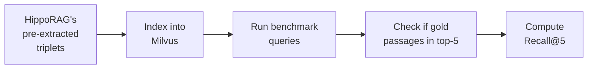

# Evaluation

Vector Graph RAG is evaluated on three standard multi-hop QA benchmarks used in the HippoRAG papers.

## Datasets

| Dataset | Description | Hop Count | Source |
|---------|-------------|-----------|--------|
| **MuSiQue** | Multi-hop questions requiring 2–4 reasoning steps | 2–4 hops | [Paper](https://arxiv.org/abs/2108.00573) |
| **HotpotQA** | Wikipedia-based multi-hop QA | 2 hops | [Paper](https://arxiv.org/abs/1809.09600) |
| **2WikiMultiHopQA** | Cross-document reasoning over Wikipedia | 2 hops | [Paper](https://arxiv.org/abs/2011.01060) |

!!! info "Evaluation Metric"
    **Recall@5** — whether the ground-truth supporting passages appear within the top-5 retrieved results. This measures retrieval quality independent of the answer generation step.

---

## Results

### Recall@5 vs. Naive RAG

<div class="bar-chart" markdown>
<div class="bar-legend">
  <div class="bar-legend-item"><div class="bar-legend-color naive"></div> Naive RAG</div>
  <div class="bar-legend-item"><div class="bar-legend-color ours"></div> Vector Graph RAG</div>
</div>

<div class="bar-group">
  <div class="bar-group-label">MuSiQue</div>
  <div class="bar-row">
    <div class="bar-label">Naive RAG</div>
    <div class="bar-track"><div class="bar-fill naive" style="width: 55.6%"></div></div>
    <div class="bar-value naive">55.6%</div>
  </div>
  <div class="bar-row">
    <div class="bar-label">Vector Graph RAG</div>
    <div class="bar-track"><div class="bar-fill ours" style="width: 73.0%"></div></div>
    <div class="bar-value ours">73.0%</div>
  </div>
</div>

<div class="bar-group">
  <div class="bar-group-label">HotpotQA</div>
  <div class="bar-row">
    <div class="bar-label">Naive RAG</div>
    <div class="bar-track"><div class="bar-fill naive" style="width: 90.8%"></div></div>
    <div class="bar-value naive">90.8%</div>
  </div>
  <div class="bar-row">
    <div class="bar-label">Vector Graph RAG</div>
    <div class="bar-track"><div class="bar-fill ours" style="width: 96.3%"></div></div>
    <div class="bar-value ours">96.3%</div>
  </div>
</div>

<div class="bar-group">
  <div class="bar-group-label">2WikiMultiHopQA</div>
  <div class="bar-row">
    <div class="bar-label">Naive RAG</div>
    <div class="bar-track"><div class="bar-fill naive" style="width: 73.7%"></div></div>
    <div class="bar-value naive">73.7%</div>
  </div>
  <div class="bar-row">
    <div class="bar-label">Vector Graph RAG</div>
    <div class="bar-track"><div class="bar-fill ours" style="width: 94.1%"></div></div>
    <div class="bar-value ours">94.1%</div>
  </div>
</div>

<div class="bar-group">
  <div class="bar-group-label">Average</div>
  <div class="bar-row">
    <div class="bar-label">Naive RAG</div>
    <div class="bar-track"><div class="bar-fill naive" style="width: 73.4%"></div></div>
    <div class="bar-value naive">73.4%</div>
  </div>
  <div class="bar-row">
    <div class="bar-label">Vector Graph RAG</div>
    <div class="bar-track"><div class="bar-fill ours" style="width: 87.8%"></div></div>
    <div class="bar-value ours">87.8%</div>
  </div>
</div>
</div>

| Method | MuSiQue | HotpotQA | 2WikiMultiHopQA | Average |
|--------|---------|----------|-----------------|---------|
| Naive RAG | 55.6% | 90.8% | 73.7% | 73.4% |
| **Vector Graph RAG** | **73.0%** | **96.3%** | **94.1%** | **87.8%** |
| Improvement | +31.4% | +6.1% | +27.7% | +19.6% |

!!! success "Key Takeaway"
    Vector Graph RAG improves over Naive RAG by **+19.6% on average**, with the largest gains on datasets requiring cross-document reasoning (MuSiQue +31.4%, 2WikiMultiHopQA +27.7%).

### Comparison with State-of-the-Art

| Method | MuSiQue | HotpotQA | 2WikiMultiHopQA | Average |
|--------|---------|----------|-----------------|---------|
| HippoRAG (ColBERTv2)[^1] | 51.9% | 77.7% | 89.1% | 72.9% |
| IRCoT + HippoRAG[^1] | 57.6% | 83.0% | 93.9% | 78.2% |
| NV-Embed-v2[^2] | 69.7% | 94.5% | 76.5% | 80.2% |
| HippoRAG 2[^2] | **74.7%** | **96.3%** | 90.4% | 87.1% |
| **Vector Graph RAG** | 73.0% | **96.3%** | **94.1%** | **87.8%** |

[^1]: [HippoRAG: Neurobiologically Inspired Long-Term Memory for LLMs (NeurIPS 2024)](https://arxiv.org/abs/2405.14831)
[^2]: [From RAG to Memory: Non-Parametric Continual Learning for LLMs (2025)](https://arxiv.org/abs/2502.14802)

!!! note "Analysis"
    - **Best average performance** (87.8%) among all compared methods
    - **Ties HippoRAG 2 on HotpotQA** (96.3%) — the most popular multi-hop benchmark
    - **Leads on 2WikiMultiHopQA** (94.1%) — +3.7% over HippoRAG 2, showing stronger cross-document reasoning
    - **Slightly behind HippoRAG 2 on MuSiQue** (73.0% vs 74.7%) — the hardest benchmark with 3–4 hop questions

---

## Methodology

!!! important "Fair Comparison"
    For fair comparison with HippoRAG, we use **the same pre-extracted triplets** from HippoRAG's repository rather than re-extracting them. This ensures the evaluation isolates the **retrieval algorithm improvements** without interference from triplet extraction quality differences.

### Evaluation Setup



1. **Triplets**: Use HippoRAG's pre-extracted `(subject, predicate, object)` triplets from each benchmark dataset
2. **Indexing**: Build the vector knowledge graph in Milvus using these triplets
3. **Querying**: Run all benchmark questions through the query pipeline
4. **Scoring**: Check whether the ground-truth supporting passages appear in the top-5 retrieved results

---

## Reproduction

Full reproduction steps are available in the evaluation directory:

```bash
# Clone the repository
git clone https://github.com/zilliztech/vector-graph-rag.git
cd vector-graph-rag

# See evaluation instructions
cat evaluation/README.md
```

See [`evaluation/README.md`](https://github.com/zilliztech/vector-graph-rag/blob/main/evaluation/README.md) for detailed instructions.
