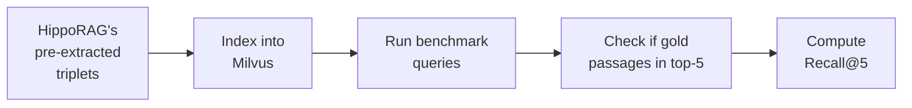

# Evaluation

Vector Graph RAG is evaluated on three standard multi-hop QA benchmarks used in the HippoRAG papers.

## Datasets

| Dataset | Description | Hop Count | Source |
|---------|-------------|-----------|--------|
| **MuSiQue** | Multi-hop questions requiring 2–4 reasoning steps | 2–4 hops | [Paper](https://arxiv.org/abs/2108.00573) |
| **HotpotQA** | Wikipedia-based multi-hop QA | 2 hops | [Paper](https://arxiv.org/abs/1809.09600) |
| **2WikiMultiHopQA** | Cross-document reasoning over Wikipedia | 2 hops | [Paper](https://arxiv.org/abs/2011.01060) |

!!! info "Evaluation Metric"
    **Recall@5** — whether the ground-truth supporting passages appear within the top-5 retrieved results. This measures retrieval quality independent of the answer generation step.

---

## Historical Results

These previously published tables are retained as historical results, before the relation-to-passage ordering correction. The new Jev replay uses corrected ordering and a separately documented sample/retrieval basis; its scores do not overwrite these tables.

> HippoRAG 2 uses a resampled HotpotQA question set. Its HotpotQA column and the three-dataset averages below are descriptive historical comparisons, not fully matched-query comparisons.

### Recall@5 vs. Naive RAG


| Method | MuSiQue | HotpotQA | 2WikiMultiHopQA | Average |
|--------|---------|----------|-----------------|---------|
| Naive RAG | 55.6% | 90.8% | 73.7% | 73.4% |
| **Vector Graph RAG** | **73.0%** | **96.3%** | **94.1%** | **87.8%** |
| Improvement | +31.4% | +6.1% | +27.7% | +19.6% |

!!! success "Key Takeaway"
    Vector Graph RAG improves over Naive RAG by **+19.6% on average**, with the largest gains on datasets requiring cross-document reasoning (MuSiQue +31.4%, 2WikiMultiHopQA +27.7%).

### Comparison with State-of-the-Art


| Method | MuSiQue | HotpotQA | 2WikiMultiHopQA | Average |
|--------|---------|----------|-----------------|---------|
| HippoRAG (ColBERTv2)[^1] | 51.9% | 77.7% | 89.1% | 72.9% |
| IRCoT + HippoRAG[^1] | 57.6% | 83.0% | 93.9% | 78.2% |
| NV-Embed-v2[^2] | 69.7% | 94.5% | 76.5% | 80.2% |
| HippoRAG 2[^2] | **74.7%** | **96.3%** | 90.4% | 87.1% |
| **Vector Graph RAG** | 73.0% | **96.3%** | **94.1%** | **87.8%** |

[^1]: [HippoRAG: Neurobiologically Inspired Long-Term Memory for LLMs (NeurIPS 2024)](https://arxiv.org/abs/2405.14831)
[^2]: [From RAG to Memory: Non-Parametric Continual Learning for LLMs (2025)](https://arxiv.org/abs/2502.14802)

!!! note "Analysis"
    - **Historical average Recall@5: 87.8%** across the three datasets
    - **Historical HotpotQA Recall@5: 96.3%**; the HippoRAG 2 question sample differs
    - **Leads on 2WikiMultiHopQA** (94.1%) — +3.7% over HippoRAG 2, showing stronger cross-document reasoning
    - **Slightly behind HippoRAG 2 on MuSiQue** (73.0% vs 74.7%) — the hardest benchmark with 3–4 hop questions

---

## Methodology

!!! important "Fair Comparison"
    For fair comparison with HippoRAG, we use **the same pre-extracted triplets** from HippoRAG's repository rather than re-extracting them. This reduces variation in extraction for runs sharing these artifacts; it does not make every external system configuration identical.

### Evaluation Setup


```mermaid
flowchart LR
    T["HippoRAG's\npre-extracted\ntriplets"] --> I["Index into\nMilvus"]
    I --> Q["Run benchmark\nqueries"]
    Q --> R["Check if gold\npassages in top-5"]
    R --> M["Compute\nRecall@5"]
```

1. **Triplets**: Use HippoRAG's pre-extracted `(subject, predicate, object)` triplets from each benchmark dataset
2. **Indexing**: Build the vector knowledge graph in Milvus using these triplets
3. **Querying**: Run all benchmark questions through the query pipeline
4. **Scoring**: Check whether the ground-truth supporting passages appear in the top-5 retrieved results

---

## Reproduction

Full reproduction steps are available in the evaluation directory:

```bash
# Clone the repository
git clone https://github.com/zilliztech/vector-graph-rag.git
cd vector-graph-rag

# See evaluation instructions
cat evaluation/README.md
```

See [`evaluation/README.md`](https://github.com/zilliztech/vector-graph-rag/blob/main/evaluation/README.md) for detailed instructions.

## Jev Reranker Evaluation

The two-stage Jev pipeline ranks relations, merges graph and direct-search passage candidates, then scores full passages. The latest evaluation covers **MuSiQue and 2Wiki, 1,000 questions each**. It is a separate recipe and dataset scope from the historical three-dataset average above.

| Method | MuSiQue | 2Wiki | Average |
|---|---:|---:|---:|
| Naive RAG · BGE-large-en-v1.5 | 58.03 | 72.73 | 65.38 |
| Naive RAG · ColBERTv2 | 49.20 | 68.20 | 58.70 |
| Naive RAG · NV-Embed-v2 | 69.70 | 76.50 | 73.10 |
| HippoRAG · ColBERTv2 | 51.90 | 89.10 | 70.50 |
| IRCoT + HippoRAG | 57.60 | 93.90 | 75.75 |
| HippoRAG 2 | 74.70 | 90.40 | 82.55 |
| Vector Graph RAG + GPT-4o-mini | 64.41 | 91.35 | 77.88 |
| Vector Graph RAG + GPT-5-mini | 73.32 | 93.80 | 83.56 |
| Vector Graph RAG + Jev · relations only | 69.30 | 90.78 | 80.04 |
| **Vector Graph RAG + Jev · two-stage** | **76.78** | **95.35** | **86.07** |


The horizontal axis excludes embedding, retrieval and answer generation. Jev uses recorded mean request durations; generative-model points use estimated range midpoints. The dotted Pareto frontier is conditional on those estimates. Naive RAG adds no judgment call, hence zero additional time.

See the [complete evaluation and reproduction instructions](https://github.com/zilliztech/vector-graph-rag/blob/main/evaluation/jev/two-stage/README.md) for the dataset checks, cached GPT replay, one historical 2Wiki fallback row, score normalization and timing sample sizes. Enable the implementation through the [reranking guide](guides/reranking.md).
