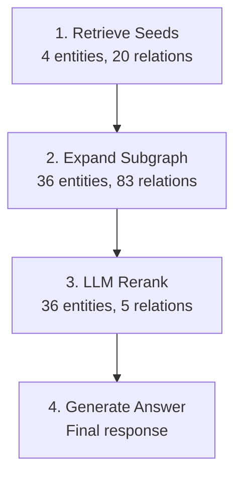
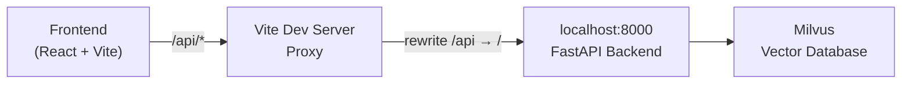

# Frontend & Visualization

The Vector Graph RAG frontend provides an interactive visualization of the graph retrieval process, allowing users to explore each step of the pipeline and inspect individual entities and relations in real time.

<!-- TODO: Add UI screenshot via GitHub image hosting -->

## Overview

The frontend is built with the following technology stack:

| Technology | Purpose |
|---|---|
| **React 19 + TypeScript** | Core UI framework |
| **Vite** | Build tool and dev server |
| **@xyflow/react (ReactFlow)** | Graph canvas rendering and interaction |
| **Tailwind CSS** | Utility-first styling |
| **Zustand** | Lightweight state management for graph and search state |
| **framer-motion** | Step animations and transitions in the timeline |
| **@tanstack/react-query** | Data fetching and caching for API calls |
| **@dagrejs/dagre** | Automatic graph layout (directed acyclic graph positioning) |
| **lucide-react** | Icon set |

---

## The 4-Step Retrieval Visualization

The UI features a **Retrieval Process** panel on the left side with 4 clickable steps. Clicking any step updates the graph canvas to reflect the state of the knowledge graph at that point in the pipeline.



### Step 1: Retrieve Seeds

Vector similarity search finds the initial set of entities and relations that best match the user's query. These appear as **orange nodes** on the graph canvas. This is the starting point for graph exploration — the "seeds" from which the subgraph will grow.

<!-- TODO: Add UI screenshot via GitHub image hosting -->

### Step 2: Expand Subgraph

Graph traversal expands outward from the seed entities, discovering connected entities and relations through the knowledge graph structure stored in Milvus. Newly discovered nodes appear as **blue nodes**, while seed nodes remain orange. This step captures the broader context surrounding the initial matches.

<!-- TODO: Add UI screenshot via GitHub image hosting -->

### Step 3: LLM Rerank

The LLM evaluates all candidate relations from the expanded subgraph and selects the most relevant ones for answering the query. **Green edges** highlight the chosen paths, while **gray dashed lines** indicate relations that were considered but not selected. This single-pass reranking avoids the cost of iterative retrieval.

<!-- TODO: Add UI screenshot via GitHub image hosting -->

### Step 4: Generate Answer

Using the selected relations as context, the LLM generates the final natural language answer. The answer appears in the **Answer Panel** alongside the graph visualization, giving users full transparency into what information was used.

<!-- TODO: Add UI screenshot via GitHub image hosting -->

---

## Color Coding

The graph uses a consistent color scheme to indicate the role of each node and edge at each step of the pipeline:

| Status | Color | Description |
|---|---|---|
| **Seed** | <span class="color-swatch swatch-seed"></span> Orange | Initial vector search results — the starting entities and relations found by similarity search |
| **Expanded** | <span class="color-swatch swatch-expanded"></span> Blue | Discovered through graph traversal — connected nodes found by expanding outward from seeds |
| **Selected** | <span class="color-swatch swatch-selected"></span> Green | Chosen by LLM reranking — the relations deemed most relevant for answering the query |
| **Filtered** | <span class="color-swatch swatch-filtered"></span> Gray | Considered but not selected — relations that were in the candidate set but filtered out by the LLM |

!!! tip
    Hover over any legend item in the UI to see a tooltip with its description. Click the help icon (?) next to the legend for a quick summary of the algorithm.

---

## Graph Interaction

The graph canvas supports several interaction modes:

- **Click nodes** to open the Node Detail Panel, which shows connected relations and source passages for that entity.
- **Pan and zoom** the graph canvas by dragging and scrolling to navigate large graphs.
- **MiniMap** in the corner provides a bird's-eye view for quick navigation across the full graph.
- **Hover** over a node to highlight its direct connections and dim unrelated parts of the graph.
- **Click timeline steps** in the Retrieval Process panel to jump between pipeline stages and see how the graph evolves.

!!! note
    The graph layout is computed automatically using the Dagre algorithm, which arranges nodes in a directed acyclic graph structure for readability.

---

## Architecture

The frontend communicates with the FastAPI backend through Vite's built-in dev server proxy. All API calls are routed through the `/api` prefix, which Vite rewrites and forwards to the backend.



### Key Frontend Modules

```
frontend/src/
├── api/              # API client and React Query hooks
│   ├── client.ts     # Axios instance with /api base URL
│   └── queries.ts    # React Query hooks for search, datasets, etc.
├── components/
│   ├── graph/        # ReactFlow graph components
│   │   ├── GraphCanvas.tsx    # Main graph canvas with ReactFlow
│   │   ├── EntityNode.tsx     # Custom node component with status coloring
│   │   ├── RelationEdge.tsx   # Custom edge component with labels
│   │   └── GraphLegend.tsx    # Color legend overlay
│   ├── panels/       # Side panels
│   │   ├── AnswerPanel.tsx    # LLM answer display
│   │   └── NodeDetailPanel.tsx # Entity detail view
│   ├── search/       # Search input and controls
│   ├── timeline/     # Retrieval process step list
│   │   └── ProcessTimeline.tsx # Clickable 4-step timeline
│   └── ui/           # Shared UI primitives
├── stores/           # Zustand state stores
│   ├── graphStore.ts    # Graph nodes, edges, and step status
│   ├── searchStore.ts   # Search query, timeline steps, loading state
│   └── datasetStore.ts  # Dataset selection
├── types/            # TypeScript type definitions
└── utils/            # Utility functions (cn, etc.)
```

---

## Running the Frontend

### Prerequisites

- Node.js 18+ and npm
- The FastAPI backend running (default port 8000)

### Development

```bash
cd frontend
npm install
npm run dev
```

The frontend will start on `http://localhost:5173` by default, with API requests proxied to the backend.

### Configuration

The API backend port is configured via the `VGRAG_API_PORT` environment variable in the project root `.env` file:

```bash
# .env (project root)
VGRAG_API_PORT=8000
```

Vite reads this variable at startup and configures the proxy target accordingly. If you change the backend port, restart the Vite dev server for the change to take effect.

### Build for Production

```bash
cd frontend
npm run build
```

The production build outputs to `frontend/dist/` and can be served by any static file server.

### Exposing to Network

To make the dev server accessible from other devices on the network:

```bash
cd frontend
npm run dev:host
```

---

## State Management

The frontend uses three Zustand stores to manage application state:

| Store | Responsibility |
|---|---|
| `graphStore` | Holds the ReactFlow nodes and edges, the full subgraph data, current step status for coloring, and selection/hover state. Rebuilds nodes and edges when the user clicks a different timeline step. |
| `searchStore` | Manages the search query, timeline steps (with labels, descriptions, and stats), the current step index, and loading state. |
| `datasetStore` | Tracks which dataset/graph is currently selected for querying. |

!!! info
    When a user clicks a timeline step, `searchStore` updates the current step index, retrieves the corresponding `nodeStatus` object, and passes it to `graphStore.setStepStatus()`. The graph store then rebuilds all node and edge statuses, causing ReactFlow to re-render with updated colors.
