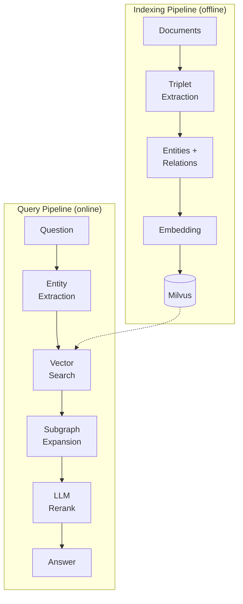
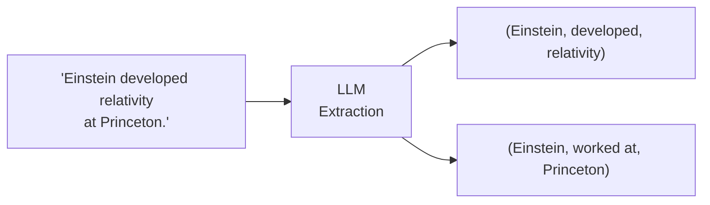
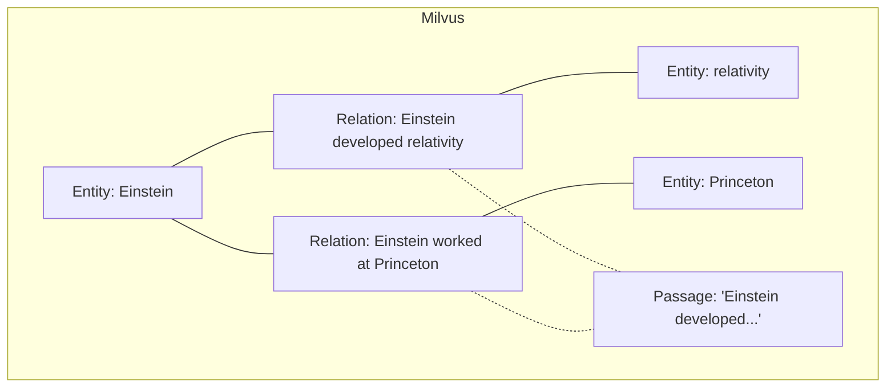
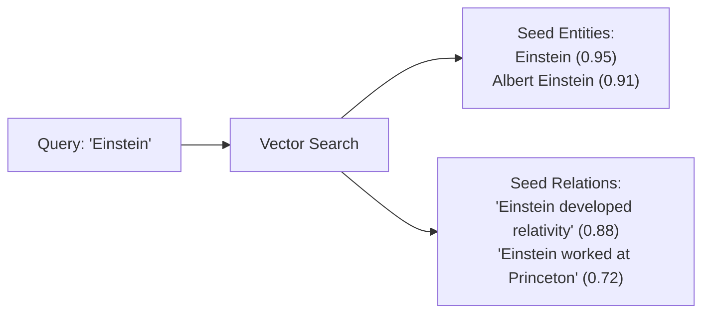
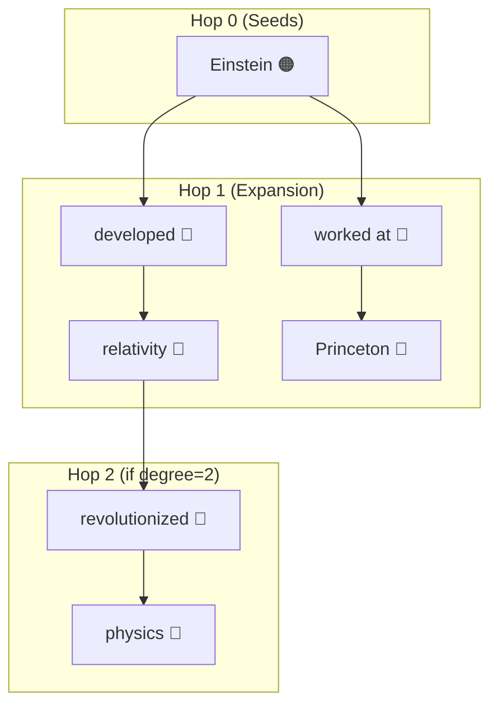
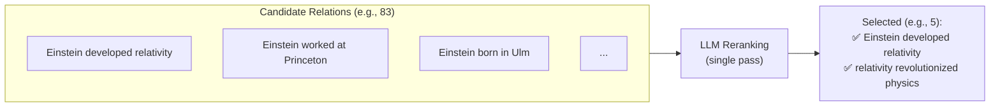
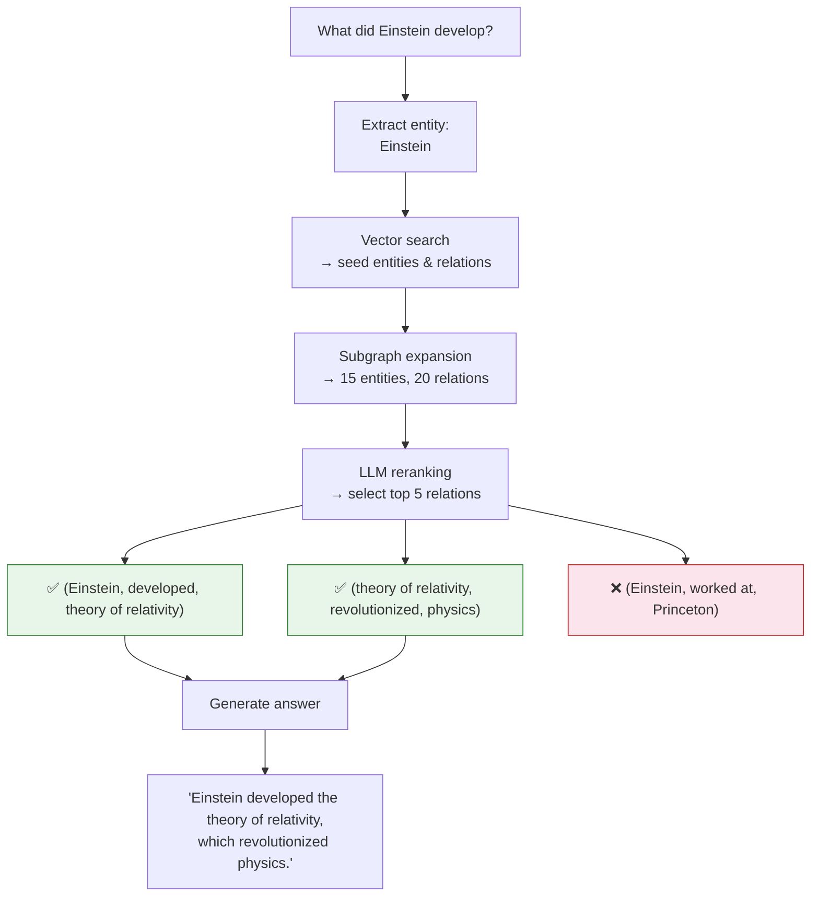

# How It Works

## Overview

Vector Graph RAG processes documents and answers questions through two main pipelines: **indexing** (offline) and **querying** (online).

---

## Indexing Pipeline

### Step 1: Triplet Extraction

An LLM extracts `(subject, predicate, object)` triplets from each document passage.

!!! example "Input → Output"
    **Input passage:** *"Einstein developed the theory of relativity at Princeton."*

    **Extracted triplets:**

    | Subject | Predicate | Object |
    |---------|-----------|--------|
    | Einstein | developed | theory of relativity |
    | Einstein | worked at | Princeton |

### Step 2: Knowledge Graph Construction

Triplets are decomposed into three types of objects, each stored as a separate Milvus collection:

| Collection | Contents | What Gets Embedded |
|------------|----------|--------------------|
| **Entities** | Unique entity names | Entity name text |
| **Relations** | Triplet text + linked entity IDs | Full relation text (e.g., "Einstein developed relativity") |
| **Passages** | Original document text + linked entity/relation IDs | Passage text |

!!! info "Cross-referencing"
    Each relation stores the IDs of its subject and object entities. Each passage stores the IDs of entities and relations extracted from it. This cross-referencing enables the subgraph expansion step during querying.

### Step 3: Embedding and Indexing

All text is embedded using the configured embedding model (default: `text-embedding-3-large`) and indexed in Milvus for vector similarity search.

---

## Query Pipeline

### Step 1: Entity Extraction

Key entities are extracted from the user's question using the LLM.

!!! example
    **Question:** *"What did Einstein develop?"*

    **Extracted entities:** `["Einstein"]`

### Step 2: Vector Search (Seed Retrieval)

The extracted entities are used to search Milvus for:

- **Similar entities** — vector search on the entity collection
- **Similar relations** — vector search on the relation collection

This produces the **seed set**: initial entities and relations that match the query.

### Step 3: Subgraph Expansion

Starting from the seed entities and relations, the algorithm expands outward through the graph:

The expansion follows these links:

1. **Seed relations** → find their **entity IDs** → add those entities
2. **New entities** → find **relations** that reference them → add those relations
3. Repeat for `expansion_degree` hops (default: 1)

!!! tip "Tuning expansion"
    - `expansion_degree=1` (default): Good for most 2-hop questions
    - `expansion_degree=2`: Better for 3-4 hop questions but retrieves more noise
    - Higher values increase recall but may decrease precision

### Step 4: LLM Reranking

The expanded subgraph typically contains many candidate relations. A single LLM call selects the most relevant ones:

!!! note "Why single-pass works"
    The combination of vector search + subgraph expansion already produces high-quality candidates. A single reranking pass is sufficient to filter the best results — no need for expensive iterative retrieval.

### Step 5: Answer Generation

The selected relations and their associated passages are used as context for the final LLM answer generation call.

---

## Worked Example

### Full Query Flow

For the question: *"What did Einstein develop?"*

1 Extract entity: `Einstein`
2 Vector search finds seed entities and relations in Milvus
3 Subgraph expansion discovers connected entities and relations
4 **LLM reranking** selects the most relevant relations — one call, no iteration
5 Generate answer from selected context

---

## Comparison with Other Approaches

| Approach | Graph DB | LLM Calls / Query | Iterative | Multi-hop | Complexity |
|----------|----------|---------------------|-----------|-----------|------------|
| **Naive RAG** | No | 1 (generation) | No | Limited | Low |
| **IRCoT** | No | 3-5+ (retrieve + reason) | Yes | Yes | High |
| **HippoRAG** | No | 1-2 | No | Yes | Medium |
| **Microsoft GraphRAG** | Yes (Neo4j) | Multiple | Yes | Yes | High |
| **Vector Graph RAG** | **No** | **2** (rerank + gen) | **No** | **Yes** | **Low** |

!!! info "Learn more"
    See the [Design Philosophy](design-philosophy.md) page for an in-depth discussion of why these architectural decisions were made and the trade-offs involved.

---

## Known Limitations

!!! warning "LLM Dependency"
    Triplet extraction and reranking quality depends heavily on the underlying LLM's capability. Weaker models may produce incomplete or inaccurate triplets, which directly affects retrieval quality.

!!! warning "Graph Consistency"
    The knowledge graph topology is maintained as a logical layer on top of Milvus via cross-referenced ID fields. Since Milvus does not support transactions, multi-step mutations (e.g., cascade deletes) are not atomic and may leave inconsistent state if interrupted. For best results, prefer batch construction via `add_documents()` over frequent incremental updates.
