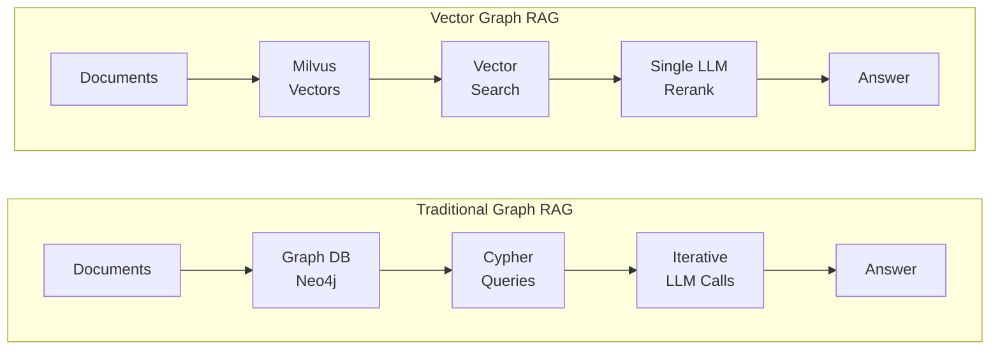
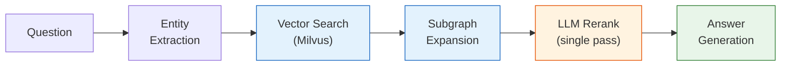

# Vector Graph RAG

**Graph RAG with pure vector search** — no graph database needed, single-pass LLM reranking, optimized for knowledge-intensive domains.

<!-- TODO: Add hero screenshot via GitHub image hosting -->

## Why Vector Graph RAG?

Most Graph RAG systems require a dedicated graph database (Neo4j, etc.) and complex multi-step retrieval with iterative LLM calls. Vector Graph RAG takes a fundamentally different approach:



!!! info "Key Advantages"
    - **No graph database** — The entire knowledge graph lives in Milvus as vectors. No extra infrastructure, no schema management, no graph query language.
    - **Single-pass reranking** — Unlike agentic approaches (IRCoT, multi-step reflection), we call the LLM just once to rerank candidate relations. Simpler, faster, and cheaper.
    - **Knowledge-intensive friendly** — Designed for domains where dense factual knowledge matters: legal documents, financial reports, medical literature, novels, and more.

## Features

<div class="feature-grid" markdown>
<div class="feature-card" markdown>

### :material-database-off: No Graph Database
Pure vector search with Milvus — no Neo4j, no ArangoDB, no extra infrastructure to deploy or manage.

</div>
<div class="feature-card" markdown>

### :material-lightning-bolt: Single-Pass Reranking
One LLM reranking call, no iterative agent loops. 2 LLM calls total per query vs 5+ for iterative approaches.

</div>
<div class="feature-card" markdown>

### :material-graph: Multi-Hop Reasoning
Subgraph expansion discovers connections across documents for complex multi-hop questions.

</div>
<div class="feature-card" markdown>

### :material-cog: Zero Configuration
Milvus Lite by default — works as a local file, no server setup needed. Just `pip install` and go.

</div>
<div class="feature-card" markdown>

### :material-chart-bar: State-of-the-Art
87.8% average Recall@5 on standard multi-hop QA benchmarks, competitive with HippoRAG 2.

</div>
<div class="feature-card" markdown>

### :material-monitor-dashboard: Visual Explorer
Interactive frontend with step-by-step retrieval visualization showing how the algorithm reasons.

</div>
</div>

## How It Works



<span class="step-badge">1</span> **Extract entities** from the question
<span class="step-badge">2</span> **Vector search** finds similar entities and relations in Milvus
<span class="step-badge">3</span> **Subgraph expansion** traverses the graph to discover multi-hop connections
<span class="step-badge">4</span> **LLM reranking** selects the most relevant relations (single pass)
<span class="step-badge">5</span> **Generate answer** from the selected context

## Quick Example

```python
from vector_graph_rag import VectorGraphRAG

rag = VectorGraphRAG()  # reads OPENAI_API_KEY from environment

rag.add_texts([
    "Albert Einstein developed the theory of relativity.",
    "The theory of relativity revolutionized our understanding of space and time.",
])

result = rag.query("What did Einstein develop?")
print(result.answer)
```

!!! tip "Getting Started"
    See the [Getting Started](getting-started.md) guide for installation and configuration options.

## Performance

| Method | MuSiQue | HotpotQA | 2WikiMultiHopQA | Average |
|--------|---------|----------|-----------------|---------|
| Naive RAG | 55.6% | 90.8% | 73.7% | 73.4% |
| IRCoT + HippoRAG | 57.6% | 83.0% | 93.9% | 78.2% |
| HippoRAG 2 | **74.7%** | **96.3%** | 90.4% | 87.1% |
| **Vector Graph RAG** | 73.0% | **96.3%** | **94.1%** | **87.8%** |

!!! note "Benchmark Details"
    Recall@5 on standard multi-hop QA benchmarks. Uses the same pre-extracted triplets as HippoRAG for fair comparison. See [Evaluation](evaluation.md) for full details.
