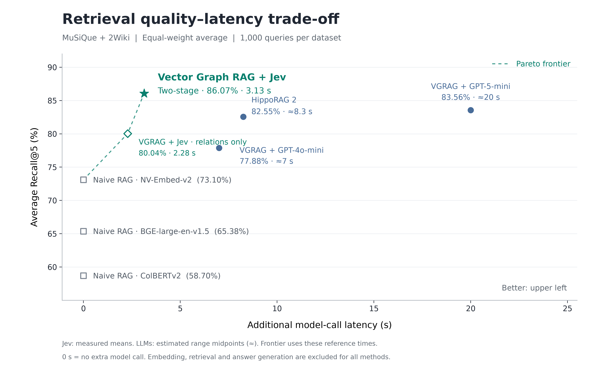

# Jev retrieval evaluation

Jev evaluation began in September 2026; the full two-stage results below were added in October 2026.

## Two-stage Jev reaches the quality–latency Pareto frontier

Across **MuSiQue and 2Wiki, 1,000 questions each**, two-stage Jev achieves **86.07% average Recall@5**: the highest retrieval quality among the compared methods. It reaches **76.78% on MuSiQue** and **95.35% on 2Wiki**, improving on both generative reranker baselines in each dataset.

The two-stage pipeline adds passage reranking after relation selection. Relations identify promising evidence; full passages give the second judgment the context needed to order that evidence. Relative to relation-only Jev, average Recall@5 rises by **6.03 percentage points**, while recorded additional model-call time increases from **2.28 to 3.13 seconds** on the same timing basis.

Average Recall@5 is also **2.51 points above Vector Graph RAG + GPT-5-mini** and **3.52 points above HippoRAG 2**. Under the reference latency estimates, two-stage Jev occupies the highest-quality point on the **Pareto frontier**: no plotted alternative offers both at least as much recall and no more model-call time, with a strict improvement in either dimension. Direct retrieval remains the option with no added judgment-call latency.

The horizontal axis measures additional model-call time, not total search time. Jev timings are recorded means; generative-model timings are estimates. See the [full evaluation report](two-stage/README.md) for all baseline scores, timing samples and assumptions, comparison provenance and offline reproduction commands.

## Use it and reproduce the results

Enable the current pipeline with `reranker_model="jev"` using the base installation; see the [reranking guide](../../docs/guides/reranking.md) for model and API configuration. The [full report](two-stage/README.md#recompute-without-api-calls) provides saved results and commands to recompute the published scores without API calls.

The earlier [500-row relation-only experiment](historical-500.md) and its source artifacts remain available for traceability; they are not the current default Jev behavior. The current two-dataset average is separate from the project's historical three-dataset comparison.
